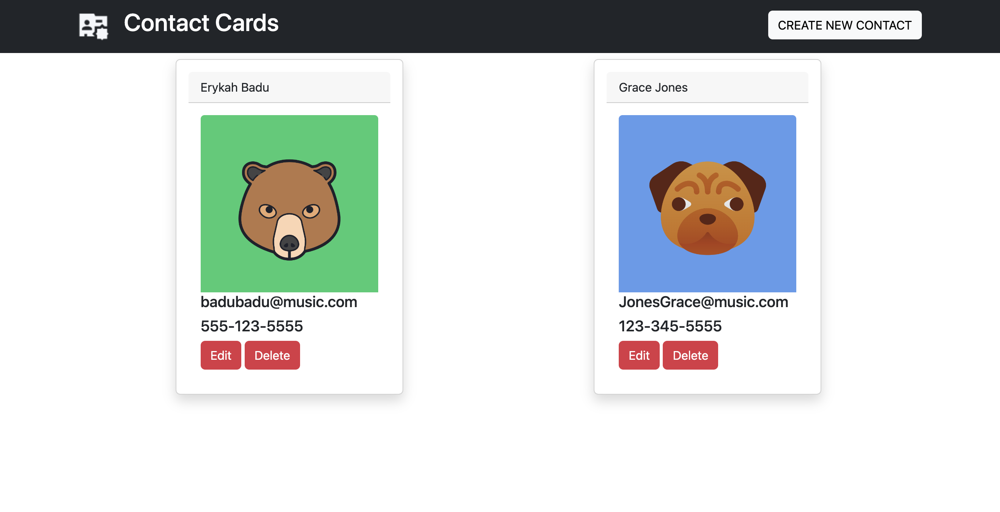

# contact-card

### User Story
 As a user I would like an app that will keep track of my contacts in a list of cards. I would like to be able to view all of those contacts on the main page when it is loaded. As a user I should be able to edit or delete my contact cards, or create new ones. 

### Features 
This app will allow you to view all your saved contacts as cards on a webpage when you load it.
This app will allow you to create a new contact by using the "create New Contact button"
This app will allow you to edit or delete existing cards on the page.

### badges

## Table of Contents

- [installation](#installation)
- [contribution guidelines](#contribution)
- [Test Instructions](#testing)
- [License](#license)
- [Questions](#questions)

### Installation

you can use the live deployed app: https://contactcardapp.herokuapp.com/
Or
You can clone the repo here: https://github.com/Vinyldude8896/contact-card

Then install dependencies : npm i
then start the server with : npm start
go to this address in your browser : http://localhost:3001/

### Contribution Guidelines
N/A as of yet
### Testing
1. you can use the live deployed app: https://contactcardapp.herokuapp.com/
Or
1. You can clone the repo here: https://github.com/Vinyldude8896/contact-card
2. Then install dependancies using npm install.
3. Navigate to the following address in your browser: http://localhost:3001/
4. Try creating a new contact
5. try editing and deleting contacts.
### Questions
    email address : kevinnivek@me.com
    - additional instructions 
    I can be contacted by phone as well, but prefer email contact first.

### Images of example readme.md

